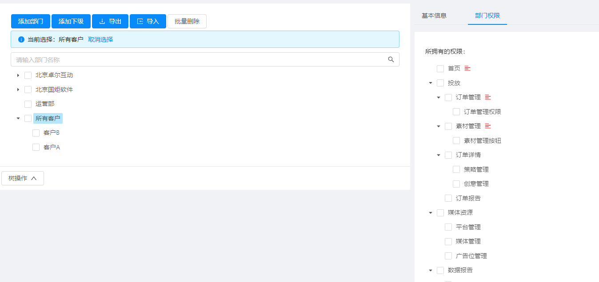
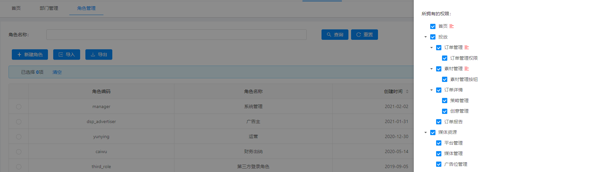
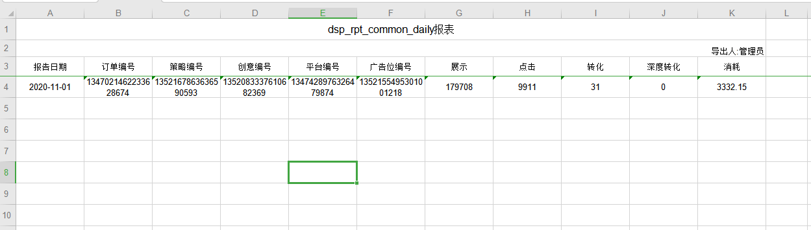

#DSP使用文档

##说明
部署
+ web：/usr/local/share/nginx/html, 启动脚本 ./sbin/nginx
+ api：/home/dsp/run ,启动脚本 java -jar jeecg-boot-module-system-2.4.0.jar
+ 数据库：/usr/local/mariadb, 启动脚本 /etc/init.d/mysqld start
+ 账户
	+ 账户1：manager，密码：Manager@123
	+ 账户2：support，密码：Support@123
	+ 账户3：supportA，密码：1qaz@WSX
	+ 账户4：supportB，密码：1qaz@WSX

##功能
+ 投放
    + 订单管理
    + 素材管理
+ 媒体资源
    + 平台管理
    + 媒体管理
    + 广告位管理
+ 客户
	+ 客户
+ 系统配置
    + 广告位尺寸
    + 广告形式
    + 行业管理
    + 报告管理
+ 系统管理
    + 用户管理
    + 角色管理
    + 部门管理

##权限部分
权限控制通过部门和角色进行控制

可进行权限控制的部分如下
+ 权限1：菜单栏（首页除外,登陆后默认进入首页）
+ 权限2：订单的增删改查
+ 权限3：素材的增删改查
+ 权限4：策略的增删改查
+ 权限5：创意的增删改查
+ 权限6：首页报告权限

权限操作
+ 权限1,2,3,4,5,6
	+ 方法1：在角色处进行授权，然后将角色赋予用户
	+ 方法2：在部门出进行授权，然后将用户放置在部门下
+ 数据报告权限
	+ <b>dashboard数据权限是通过部门进行限制，在报告管理的地方上传数据报告时，注意选择指定的部门</b>

##使用
**添加运营用户**
1、新增用户
2、部门处制定为所有客户和指定服务的客户
3、角色指定为运营

**添加客户**
1、新增客户
2、部门管理，"所有客户"下新增下级部门

**添加客户账户**
1、新增用户
2、角色指定为广告主
3、部门选择所属的部门

**新增订单，策略，创意**
1、使用运营账户登录
2、切换为指定客户部门
3、新增订单

**新增素材**
1、使用运营账号登陆
2、切换为指定客户部门
3、新增素材

**上传数据报告**
1、切换到指定客户部门
2、系统配置->报告管理
3、查找数据指定订单的编号
4、查找数据指定策略编号
5、查找数据指定创意编号
6、查找数据指定平台编号
7、查找数据指定广告位编号
8、拼接excel，上传文件格式与下载文件格式相同，填写数据后注意删除空行

